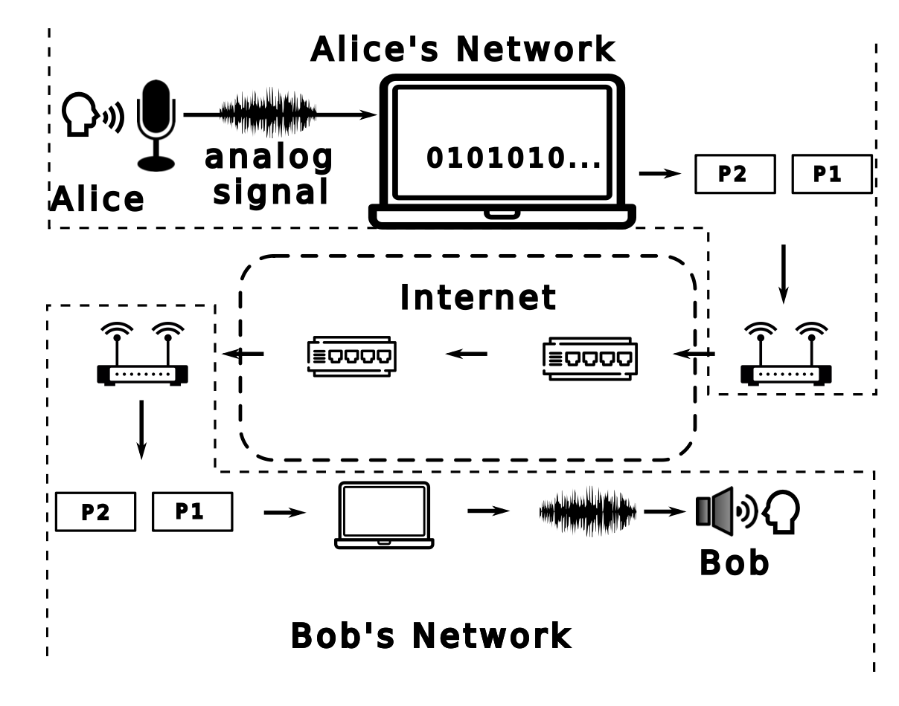
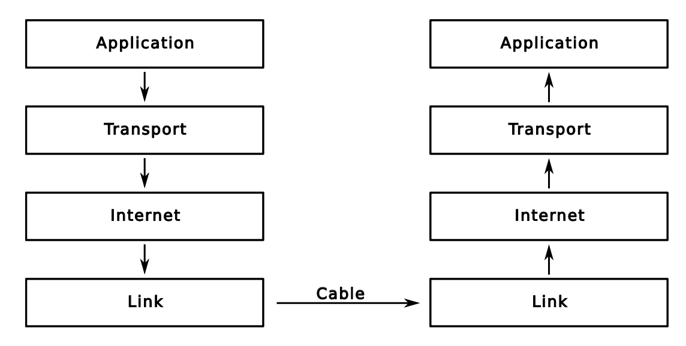

# Introduzione a Internet
Solamente l'ultima parte sarà argomento d'esame. La prima parte contiene solamente informazioni di base.

### Commutazione di circuito
Le prime reti erano a **commutazione di circuito**, questo significa che esisteva un circuito che connetteva direttamente un punto $A$ ad un punto $B$.

Si è subito presentato il problema del **multpiplexing**: per poter connettere $n$ punti tra loro, servono $n(n-1)/2$ circuiti (un cavo per ogni utente al quale voglio connettermi). Questo è un problema di **scalabilità**.

Nacquero cosi gli **switch**: dispositivi in grado di aggregare più linee in modo da formare reti gerarchiche.

### Commutazione di pacchetto
La commutazione di pacchetto è un tipo di comunicazione che prevede la divisione dell'informazione in una serie di pacchetti contenenti dei bit.

Questo tipo di comunicazione ha portato ad una serie di **vantaggi**:
- ogni link è in grado di utlizzare tecnologie diverse: puoi usare wireless a casa, dal router al provider usi il rame e la fibra ottica attraverso Internet.
- una volta che i dati sono stati digitalizzati, possono contenere qualsiasi tipo di informazione (audio, video, testo, immagini, ecc.)
- il routing è **dinamico**: nel caso in cui un percorso tra due nodi fallisce, l'informazione viene trasportata attraverso un altro percorso (per questo motivo le reti a commutazione di pacchetto sono più *robuste* e *self-healing*).

# Internet
Internet è **decentralizzato**: non è infatti presente un ente centrale che ne regola il funzionamento, non esiste una gerarchia prestabilita e non esiste un ente che ne regola l'accesso.
Attraverso l'uso di **layer** e **protocolli** siamo in grado di regolare la comunicazione.

## Layer
Il sistema che gestisce la connessione all'interno di un computer è diviso in **layer**; ogni layer si occupa di eseguire una specifica funzione. L'insieme di questi layer è chiamato **network stack**.

### Stack TCP/IP
Il protocollo TCP/IP è il protocollo di comunicazione più utilizzato su Internet. Esso è composto da 4 layer:
- **application**: contiene i protocolli che regolano il comportamento delle applicazioni (HTTP, FTP, ecc.)
- **transport**: è responsabile dell'affidabilità delle connessioni
- **internet**: fa in modo che diversi dispositivi fisci siano in grado di comunicare tra di loro, si occupa anche di *indirizzamento*
- **link**: specifica come la comunicazione fisica tra due dispositivi deve avvenire (wireless, wired, ecc.)

### Stack ISO-OSI
rispetto al TCP/IP, lo stack ISO-OSI ha 3 layer aggiuntivi:
- **data link**: si occupa di defire come trasmettere i dati tra due dispositivi collegati direttamente tra di loro
- **session**: specifica come mantenere la sessione di un utente
- **presentation**: specifica come presentare i dati

## Protocolli
Per ogni layer esiste un **protocollo** (anche più di uno come vedremo) che ne regola il funzionamento. Un protocollo è un insieme di regole che definiscono il formato e l'ordine dei messaggi scambiati tra due o più entità comunicanti, così come le azioni che devono essere intraprese all'invio o alla ricezione di un messaggio o di altri eventi.

## Network stack
L'approccio a layer è fondamentale per garantire l'**astrazione** delle applicazioni internet. Ogni layer è infatti responsabile di un compito specifico e non deve preoccuparsi di come gli altri layer svolgono il loro lavoro.

*Idealmente* ogni layer ogni layer comunica direttamente solamente con il corrispondente layer dall'altra parte della comunicazione.

In *pratica* la comunicazione avviene attraverso il passaggio per tutti i layer. I layer **transport**, **Internet** e **link** sono implementati direttamente all'iterno del sistema operativo, mentre il layer **application** è implementato all'interno delle applicazioni.

## Interfacce e servizi
Ogni layer offre un'interfaccia ai livelli superiori e inferiori. Infatti quando si programma ad un livello $n$ si accede direttamente alle API fornite dal livello $n-1$. Si dice che un layer offre servizi al livello superiore.

## Incapsulamento (TCP/IP)
Ogni layer **incapsula** le informazioni riceveute dal layer superiore:
- **application**: produce dati grezzi
- **transport**: spezzetta i dati grezzi e li inserisce all'interno di un **segmento** e aggiunge un **header** (TCP)
- **internet**: prende il segmento e aggiunge un **header IP**, in questo livello viene chiamato **pacchetto**
- **link**: aggiunge l'header e trasmette il **segmento**

Quando si arriva dall'altra parte viene effettuato il processo inverso e l'applicazione riceve i dati grezzi senza sapere cosa è successo.