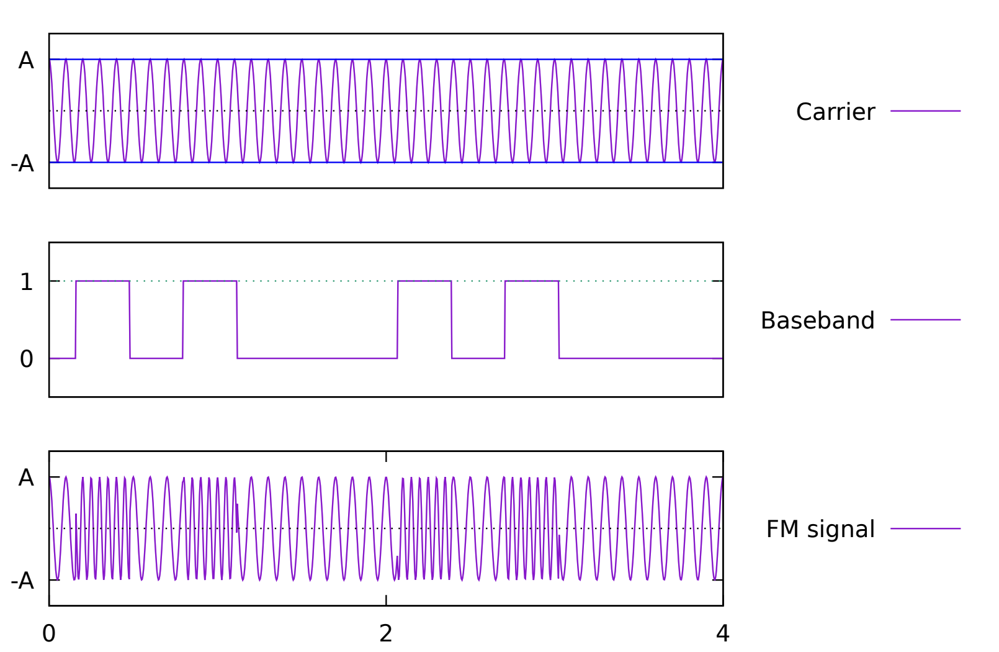

# Livello Fisico

#### bit-rate
rappresenta la velocita di comunicazione, espressa in bit al secondo (bs)
| bit rate  | bit per second | esempio                   |
| :-------: | :------------: | :-----------------------: |
| $1 Kbp/s$ | $10^3 b/s$     | Traffico di un device IoT |
| $1Mbp/s$  | $10^6 b/s$     | connessione 3G/4G         |
| $1Gbp/s$  | $10^9 b/s$     | connession FTTH           |
| $1 Tbp/s$ | $10^12 b/s$    | dorsale internet          |

#### attenuazione e rumore
- **attenuazione**: una parte della potenza che il generatore immette all'interno del circuito viene persa a causa della resistenza del cavo (maggiore la distanza maggiore la resistenza); questo comporta che il segnale che viene ricevuto è lo stesso ma risulta più debole
- **delay**: gli non viaggiano ad una velocità infinata, per questo il segnale impiega un determinato tempo per raggiungere il destinatario (maggiore la distanza e maggiore il delay)
- **rumore**: gli elettroni non sono mai fermi (tranne a zer Kelvin), a temperatura ambiente si muovono. Per questo una comunicazione è rappresentata dal segnale assieme ad un certo rumore (può provenire anche da sorgenti diverse)

#### signal to noise ratio (SNR)
Considerando la definizione di rumore sappiamo che viene ricevuto il segnale assieme al rumore. Il destinatario deve essere in grado di distinguere il segnale dal rumore, per questo si utilizza il rapporto segnale rumore (SNR) che rappresenta la potenza del segnale rispetto al rumore. Se il SNR è basso il destinatario non è in grado di distinguere il segnale dal rumore, se è alto il destinatario è in grado di distinguere il segnale dal rumore.
$$
SNR=\frac{\text{potenza del segnale ricevuto}}{\text{potenza del rumore}}
$$
L'SNR è fondamentale per misurare la qualità di una comunicazione.

#### definizioni
- **sensibilità**: ogni ricevitore deve ricevere una potenza minima per poter distinguere il segnale dal rumore, sotto a quel livello di sensibilità il ricevitore considera quello come rumore
- **attenuazione**: il segnale è trasmesso attraverso un canale di comunicazione, durante il percorso il segnale perde potenza a causa della resistenza del cavo
- **synchronization**: mittente e destinatario devono accordarsi su quando un certo simbolo inizia e quando termina, quanto dura, ...

#### modulazione
In un segnale modulato si ha:
- un **carrirer signal** rappresentato da un segnale sinusoidale con frequenza $f_c$
- un **message signal** rappresentato da un segnale che contiene le informazioni da trasmettere

L'idea consiste nel nel modificare **ampiezza**, **frequenza** o **fase** in modo da codificare il messaggio

### teoremi fondamentali
#### teorema di Nyquist
Il teorema Nyquist dice che se si ha un segnale con banda $B$, sei in grado di trasmettere al massimo $B$ simboli alla volta
Capacità massima teorica:
$$
C=2B\log_2({M})
$$
solitamente $M$ è una potenza di 2

**esempio**
un router wireless use frequenze che variano da $\text{2401 MHz}$ a $\text{2441 Mhz}$, assumendo che codifica $4$ bit per ogni simbolo
Quanto è il bit-rate massimo?

$$
B = 2.441.000.000 - 2.401.000.000=40.000.000 \qquad
C=B\log_2({4}) = 40.000.000 \cdot 2 = 80Mb/s
$$

Il teorema di Nyquist ignora completamente il rumore, il che rende la ricezione dell'informazione più complicata, per questo c'è un una legge fondamentale che dobbiamo conoscere

