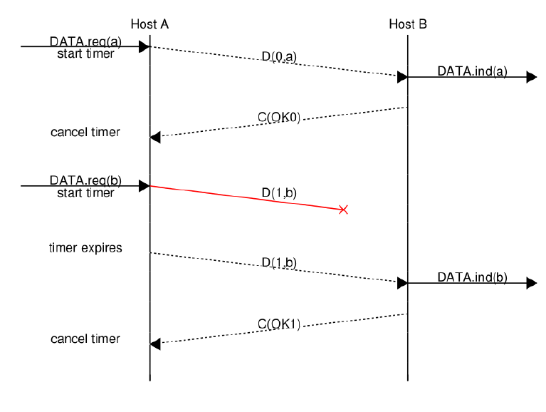
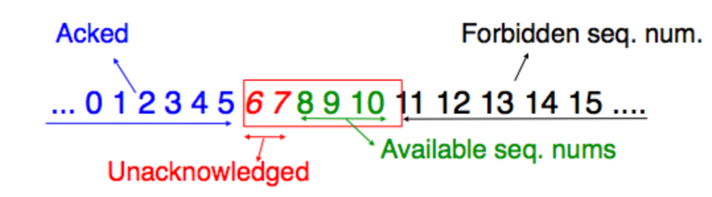

# Data Link

La trasimissione di un bit alla volta è sconsigliata, è preferibile trovare un modo per scrivere del software che si occupa di inviare messaggi o interi files.
L'unità di informazione base che viene inviata è chiamato **frame**: è una sequenza di bit con una lunghezza massima e una strutture predefinita.

**come fa il destinatario a capire il termine di un frame?**
Idealmente quando il mittente ha finito di inviare informazioni, semplicemente smette di trasmettere.
Il problema è che, modulando il segnale, il [carrier signal](./02-livello_fisico.md) è sempre acceso.
E' necessario quindi trovare un modo per specificare l'inizio e la fine di un frame.

### bit stuffing
L'idea è che viene riservata la stringa `01111110` per indicare l'inizio e la fine di un frame.
In questo modo il problema non è completamente risolto, infatti, che succede se il mittente invia un messaggio codificato esaustivamente con `01111110`?
Il mitttente deve assicurarsi che non ci siano mai sei `1` di fila.
#### encoding
- all'inizio viene inviata la sequenza `01111110`
- inviati i frame necessari
- inserito uno `0` dopo il quinto `1` consecutivo
- alla fina viene inviata la sequenza `01111110`
#### decoding
- viene ricevuta la sequenza `01111110`
- ricevuti i frame
- se uno `0` segue 5 `1` consecutivi viene rimosso
- viene ricevuta la sequenza `01111110`

### limitazioni
per poter rappresentare correttamente le informazioni è necessario inviare extra dati rispetto al messaggio di partenza (*frame iniziale, frame finale, bit stuffing*)
Queste informazioni aggiuntive vengono chiamate **overhead** che riduece il bit-rate definito dalle formule di *Shannon* e *Nyquist*.
**caso peggiore**
Sono costantemente aggiunti `2 bytes` di dati per indicare l'inizio e la fine della trasmissione.
Se la trasmissione è composta da tutti `1`, si dovrà aggiungere uno `0` ogni 5, si sta riducendo di $\frac{1}{6}$ il bit-rate.

---
Il protocollo **bit-stuffing** è stato ormai superato da protocolli più efficienti come **character-stuffing** e **octet-stuffing**.

## SDUs
I Service Data Unit sono i dati ricevuti dal livello superiore (rete) che vengno incapsulati all'interno di un frame datalink.
Ecco il funzionamento nel dettaglio:
1. **ricezione dei dati**: quando i dati sono ricevuto dal livello superiore essi sono definiti **SDUs**
2. **incapsulamento**: vengono incapsulati gli SDU all'interno di un frame datalink (PDU) contenente intestazione e coda
3. **trasmissione**: il frame viene trasmesso al livello fisico
4. **ricezione**: il frame viene ricevuto dal livello fisico del destinatario, passato al livello datalink che trasforma il frame in un SDU da passare al livello superiore

## acknowledging frames
Sono dei frame speciali che non contengono dati, sono utilizzati semplicemente per confermare che il frame precedentemente è stato correttamente ricevuto.
Esiste un modo per distinguere gli ack dagli altri frame; viene seprato in due:
- **header**: non contiene dati, semplicemente indica il tipo del frame (`1` per **ack**, `0` per **dati**)
- **payload**: contiene l'informazione che deve essere trasmessa

Questa tecnica risulta utile per evitare di sovraccaricare il ricevente, ma non abbiamo ancora considerato la possibilità che ci siano errori nella trasmissione.

## link errors
Un frame può contenere **errori**: bit invertiti, bit mancanti, bit in eccesso

### error detection
E' il processo per controllare che all'interno del frame non siano presenti errori, si occupa solamente di rilevarne la presenza, non si occupa di correggerli.
#### bit di partià
la più semplice forma di **error detection** consiste nel **bit di parità**: consiste in un bit aggiunto al frame per indicare se il numero di `1` è pari o dispari. Il ricevitore controlla se il numero di `1` è pari o dispari (attraverso il bit parità), se è diverso da quello che dovrebbe essere, allora c'è un errore.

- **bit di parità nel mittente**: se il numero di `1` è dispari, viene aggiunto `1` altri `0` Computazionalmente, per capire il bit da aggiungere viene fatto il modulo 2 della somma dei bit del frame (nel caso parità dispari, al risultato è aggiunto 1, dipende da come ci si è organizzati per la trasmissione).
- **bit di parità nel ricevitore**: supponendo di utilizzare la parità dispari, il ricevitore sa che il numero di `1` deve essere dispari. Se non sono presenti errori, l'SDU viene passato al livello superiore, altrimenti sono attuate delle azioni in base al design del livello datalink (richiesto il reinvio, scartato, ...)

Una limitazione del **bit di parità** sta nel caso in cui sia presente un numero pari di errori, questo fa si che il ricevitore non noti la presenza di errori

#### Internet checksum
E' un algoritmo che permette di rilevare errori in un frame.
1. **calcolo**: 
    - i dati sono divisi in blocchi di dimensione fissa (es. 16 bit)
    - vengono sommati tutti i blocchi e si controlla la presenza di un riporto (**carry**) che viene aggiunto alla somma
    - viene fatto il complemento a 2 (inversione dei bit)
2. **inserimento**: il risultato della somma è inserito all'interno dell'header del frame
3. **verifica**: 
    - Il ricevitore calcola il checksum sui dati ricevuti (compreso il checksum nell'header)
    - se i due checksum corrispondono allora non ci sono errori, altrimenti sono presenti errori

Non è l'algoritmo più avanzato (CRC o crittografia lo sono) ma fornisce una buon livello di verifica dell'integrità dei dati.

## reliable transport
#### error detection vs error correction
attraverso il checksum siamo in grado di capire se c'è stato un errore (error detection).
Possiamo anche implementare una tecnica di **error correction** che consiste nella ridondanza dei dati in modo da fare sia error detection che error correction.
Il modo più semplice consiste nell'utilizzare nel **redundant encoding**: 1 bit è mappato con $n$ bit, in questo modo è possibile rilevare e correggere un errore (es. `1` è rappresentato con `111`).
E' un approccio poco efficiente, stiamo sprecando molta banda per rappresentare un singolo bit. Il moderno approccio consiste nel **scartare** i frame con errori.

#### errori nel data frames
Viene introdotto un **timer**, parte quando il mittente invia il frame e termina quando riceve l'ACK dal destinatario.
- **ACK ricevuto**: il frame è stato ricevuto correttamente, il timer viene fermato
- **ACK non ricevuto**: il frame è stato perso, il timer scade e viene ritrasmesso il frame
- **scade il timer**: o non è mai arrivato il frame o non è mai arrivato l'ACK, il frame viene ritrasmesso

#### errori nell'ACK
Nel caso in cui l'ACK venga perso, il mittente non riceve nessuna informazione e quindi non sa se il frame è stato ricevuto correttamente o meno. In questo modo ritrasmette il frame, il problema sta nel fatto che il mittente riceve lo stesso frame due volte e non sa se è un nuovo frame o se è duplicato.

#### sequence number
Il destinatario deve avere un modo per distinguere i frame duplicati dai frame nuovi. Viene aggiunto all'header del frame un sequence number composto da un bit che viene alternato, questo processo è chiamato **Alternate Bit Protocol (ABP)**.

### Alternate Bit Protocol

- **mittente**: 
    - invia il frame con il sequence number `0`
    - aspetta l'ACK
    - se l'ACK è ricevuto, invia il frame con il sequence number `1`
    - se l'ACK non è ricevuto, ritrasmette il frame con il sequence number `0`
- **destinatario**:
  - riceve il frame con il sequence number `0`
    - se il frame è corretto, invia l'ACK con il sequence number `0`
    - se il frame è corrotto, scarta il frame e non invia l'ACK

Aggiungendo il bit nell'header del frame è stata cambiata la struttura del frame, l'interfaccia superiore non è a conoscenza di questo cambiamento.

**performance**
Soffermiamoci un momento sulle performance di questo protocollo.
Supponiamo di voler trasmettere un frame di `1500B`, il tempo di trasmissione è di `10ms` (`RTT=20ms`). Assumiamo inoltre che la rete abbia una capacità di $10^9 b/s$. Il frame impegherà quindi $\frac{1500*8}{10^9}=0.012ms$ ad essere trasmesso (l'ACK è molto piccolo quindi trascurabile).
Non stiamo sfruttando le capacità della rete perchè nello stesso tempo siamo in grado di inviare molti più frame.

### pipelining
questa tecnica consiste nell'inviare una serie di frame senza aspettare l'acknowledgment dal destinatario. Dobbiamo comunque evitare di sovraccaricare la rete e mantenere l'affidabilità, introduciamo la **sliding window**.

### sliding window

In quest o caso i numeri di sequenza sono composti da una serie di bit per poter garantire la trasmissione di piu frame.
Nell'immagine A e B si sono accordati per avere una sliding window grande 5, in questo modo A invierà 5 frame e si fermerà in attesa dell'ACK. Appena viene ricevuto l'ACK relativo al sequence number più basso nella sliding window si sposta la sliding window.

#### flow control and frame loss
La finestra scorrevole implementa il controllo di flusso e riduce l'impatto dell'RTT; in questo modo i frame arrivano in blocco e vengono ACKd in blocco.
Abbiamo bisogno di una politica per gestire la **perdita** di qualche frame.
**side note**: se prendiamo per esempio un server, il cui compito è gestire molte connessioni allo stesso tempo, la politica oltre a funzionare correttamente deve essere anche veloce. In questo caso non importa se è perfetta.

## go-back-n
- **ricevitore**:
  - accetta solamente i frame che arrivano in-sequence
  - appena il destinatario riceve un frame, invia l'ACK contenente il sequence number dell'ultimo frame in-sequence
  - il destinatario scarta ogni frame che non è in-sequence
  - L'ACK è considerato *cumulativo* nel senso che, oltre a confermare il suo sequence number, conferma anche tutti i frame precedenti
  - I frame sono processati uno ad uno, il ricevitore non contiene alcun buffer
- **mittente**:
  - il mittente possiede un **buffer** della dimensionde della sliding window
  - i frame sono inviati con sequence number crescenti fino a quando non si riempie la sliding window
  - se il buffer è pieno, il mittente si ferma in attesa degli ACK
  - il mittente, dato che risulta computazionalmente complicato mantenere un timer per ogni frame da inviare, ne ha solamete uno condiviso che viene avviato quando il primo frame è inviato.
  - Appena il mittente riceve un ACK
    - rimuove tutti i frame ACKd (gli ACK sono cumulativi)
    - fa ripartire il timer solamente se ci sono ancora frame nel buffer
  - se scade il timer il mittente ritrasmette tutti i frame nel buffer che non sono stati ACKd

#### limitazioni
go-back-n è semplice da implementare e aiuta a ridurre l'impatto dell'RTT, ma, se ci sono molte perdite risulta inefficiente:
- il detinatario accetta solo i frame in-sequence
- il mittente invia **tutti** i frame non confermati

### selective repeat
E' un modo per migliorare il go-back-n
- il destinatario ora contiene un buffer e accetta i frame all'interno della finestra
- nell'ACK viene inviato, oltre al sequence number subito prima l'inizio della finestra, la lista di sequence number dei frame ricevuti correttamente ma fuori ordine
- il mittente quindi ritrasmette solamente quelli che non sono stati ACKd