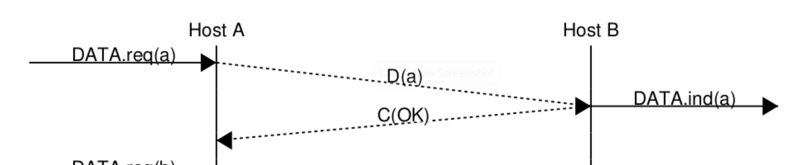

# Data Link

La trasimissione di un bit alla volta è sconsigliata, è preferibile trovare un modo per scrivere del software che si occupa di inviare messaggi o interi files.
L'unità di informazione base che viene inviata è chiamato **frame**: è una sequenza di bit con una lunghezza massima e una strutture predefinita.

**come fa il destinatario a capire il termine di un frame?**
Idealmente quando il mittente ha finito di inviare informazioni, semplicemente smette di trasmettere.
Il problema è che, modulando il segnale, il [carrier signal](./02-livello_fisico.md) è sempre acceso.
E' necessario quindi trovare un modo per specificare l'inizio e la fine di un frame.

### bit stuffing
L'idea è che viene riservata la stringa `01111110` per indicare l'inizio e la fine di un frame.
In questo modo il problema non è completamente risolto, infatti, che succede se il mittente invia un messaggio codificato esaustivamente con `01111110`?
Il mitttente deve assicurarsi che non ci siano mai sei `1` di fila.
#### encoding
- all'inizio viene inviata la sequenza `01111110`
- inviati i frame necessari
- inserito uno `0` dopo il quinto `1` consecutivo
- alla fina viene inviata la sequenza `01111110`
#### decoding
- viene ricevuta la sequenza `01111110`
- ricevuti i frame
- se uno `0` segue 5 `1` consecutivi viene rimosso
- viene ricevuta la sequenza `01111110`

### limitazioni
per poter rappresentare correttamente le informazioni è necessario inviare extra dati rispetto al messaggio di partenza (*frame iniziale, frame finale, bit stuffing*)
Queste informazioni aggiuntive vengono chiamate **overhead** che riduece il bit-rate definito dalle formule di *Shannon* e *Nyquist*.
**caso peggiore**
Sono costantemente aggiunti `2 bytes` di dati per indicare l'inizio e la fine della trasmissione.
Se la trasmissione è composta da tutti `1`, si dovrà aggiungere uno `0` ogni 5, si sta riducendo di $\frac{1}{6}$ il bit-rate.

---
Il protocollo **bit-stuffing** è stato ormai superato da protocolli più efficienti come **character-stuffing** e **octet-stuffing**.

## SDUs
I Service Data Unit sono i dati ricevuti dal livello superiore (rete) che vengno incapsulati all'interno di un frame datalink.
Ecco il funzionamento nel dettaglio:
1. **ricezione dei dati**: quando i dati sono ricevuto dal livello superiore essi sono definiti **SDUs**
2. **incapsulamento**: vengono incapsulati gli SDU all'interno di un frame datalink (PDU) contenente intestazione e coda
3. **trasmissione**: il frame viene trasmesso al livello fisico
4. **ricezione**: il frame viene ricevuto dal livello fisico del destinatario, passato al livello datalink che trasforma il frame in un SDU da passare al livello superiore

## acknowledging frames
Sono dei frame speciali che non contengono dati, sono utilizzati semplicemente per confermare che il frame precedentemente è stato correttamente ricevuto.
Esiste un modo per distinguere gli ack dagli altri frame; viene seprato in due:
- **header**: non contiene dati, semplicemente indica il tipo del frame (`1` per **ack**, `0` per **dati**)
- **payload**: contiene l'informazione che deve essere trasmessa

Questa tecnica risulta utile per evitare di sovraccaricare il ricevente, ma non abbiamo ancora considerato la possibilità che ci siano errori nella trasmissione.

## link errors
Un frame può contenere **errori**: bit invertiti, bit mancanti, bit in eccesso

### error detection
E' il processo per controllare che all'interno del frame non siano presenti errori, si occupa solamente di rilevarne la presenza, non si occupa di correggerli.
#### bit di partià
la più semplice forma di **error detection** consiste nel **bit di parità**: consiste in un bit aggiunto al frame per indicare se il numero di `1` è pari o dispari. Il ricevitore controlla se il numero di `1` è pari o dispari (attraverso il bit parità), se è diverso da quello che dovrebbe essere, allora c'è un errore.

- **bit di parità nel mittente**: se il numero di `1` è dispari, viene aggiunto `1` altri `0` Computazionalmente, per capire il bit da aggiungere viene fatto il modulo 2 della somma dei bit del frame (nel caso parità dispari, al risultato è aggiunto 1, dipende da come ci si è organizzati per la trasmissione).
- **bit di parità nel ricevitore**: supponendo di utilizzare la parità dispari, il ricevitore sa che il numero di `1` deve essere dispari. Se non sono presenti errori, l'SDU viene passato al livello superiore, altrimenti sono attuate delle azioni in base al design del livello datalink (richiesto il reinvio, scartato, ...)

Una limitazione del **bit di parità** sta nel caso in cui sia presente un numero pari di errori, questo fa si che il ricevitore non noti la presenza di errori

#### Internet checksum
E' un algoritmo che permette di rilevare errori in un frame.
1. **calcolo**: 
    - i dati sono divisi in blocchi di dimensione fissa (es. 16 bit)
    - vengono sommati tutti i blocchi e si controlla la presenza di un riporto (**carry**) che viene aggiunto alla somma
    - viene fatto il complemento a 2 (inversione dei bit)
2. **inserimento**: il risultato della somma è inserito all'interno dell'header del frame
3. **verifica**: 
    - Il ricevitore calcola il checksum sui dati ricevuti (compreso il checksum nell'header)
    - se i due checksum corrispondono allora non ci sono errori, altrimenti sono presenti errori

Non è l'algoritmo più avanzato (CRC o crittografia lo sono) ma fornisce una buon livello di verifica dell'integrità dei dati.

