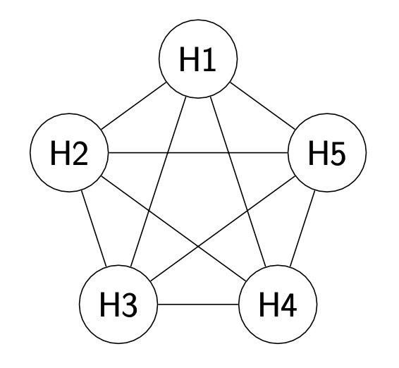
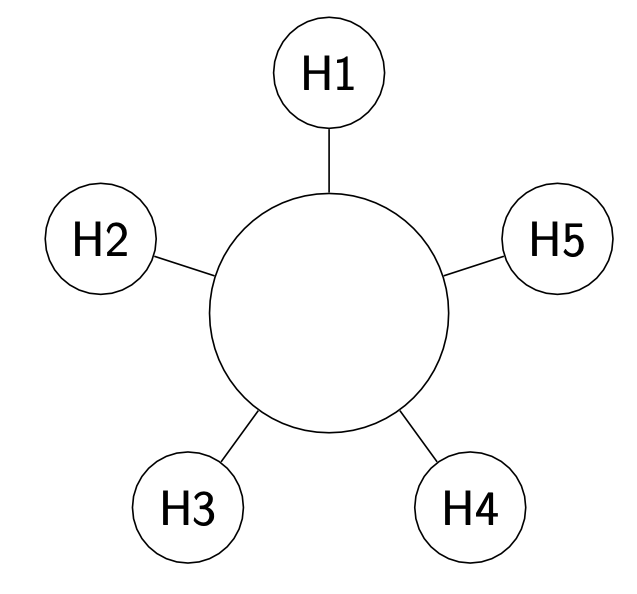
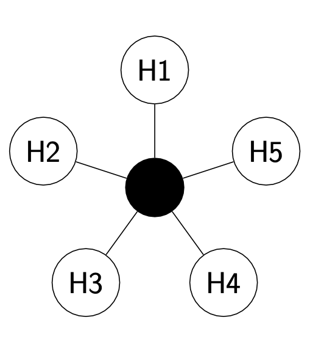
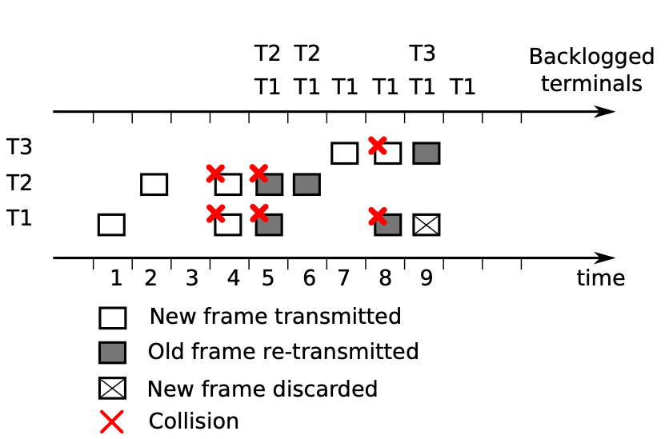

## sharing resources
fino ad ora ci siamo sempre concentrati su due host. Nel mondo reale la connessione è effettuata tra diversi dispositivi contemporaneamente, come facciamo a connettere diversi host contemporaneamente?

#### full mesh network

- **pro**: è una rete molto robusta, che consente una comunicazione diretta con ogni host
- **contro**: la rete è difficile da far scalare, infatti, se si aggiunge un nodo, bisogna creare molti collegamenti

#### bus network

- **pro**: molto economica come rete, infatti è presente un solo canale di comunicazione
- **contro**: non scala, infatti tutte le comunicazioni devono passare per lo stesso cavo; inoltre non è nemmeno robusta, se il cavo si guasta, la rete smette di funzionare

#### ring network

- **pro**: è una soluzione più robusta
- **contro**: risulta comunque complicato farla scalare

#### star network

- **pro** è una rete abbastanza robusta, in quanto si ha un link dedicato per ogni nodo, è semplice da gestire, infatti è presente un nodo centrale a gestire l'intera rete
- **contro**: se il nodo centrale smette di funzionare, tutta la rete smette di funzionare

---
consideriamo la rete a bus dove tutte le informazioni passano attraverso lo stesso cavo. Le comunicazioni non devono interferire tra di loro; se due host comunicano allo stesso tempo, il destinatario non è più in grado di distinguere i due segnali. Esistono delle tecniche per poter evitare le **collisioni**.

le reti **wireless** sono organizzate logicamente come una rete a stella, ma praticamente lavorano come una rete a bus. Un router centrale si occupa di gesire le connessioni e, se due host comunicano allo stesso tempo, avviene una collsione. Il livello **data link** ha il compito di organizzare l'accesso al mezzo fisico

Quindi è impossibile che non ci siano interferenze, è necessario allora trovare tecniche che permettano di gestire le collisioni

## collision detection
#### frequency division
l'idea consiste nel far passare le comunicazioni in frequnze diverse, in modo da evitare le collisioni. è quello che succede nelle comunicazioni wireless: quando viene acceso un access point, ascolta la rete per caprire su che range di frequenze poter trasmettere, gli host che si collegano su quell'ap dovranno stare in quel range di frequenze

#### TDMA
è l'acronimo di **Time Division Multiple Access**. Dati $m$ trasmettitori, il tempo è diviso in $m$ slot e ogni slot è assegnato ad uno specifico terminale.
Quando tutti terminali trasmettono allora la rete è definita **satura**, in questa condizione TDMA ha raggiunto la **massima efficienza**.
Nel caso in cui un solo host deve trasmettere deve attendere comunque il suo slot per poter trasmettere, TDMA risulta quindi **inefficiente** quando la rete è scarica e **efficiente** quando la reta è a congestione

#### random access
l'idea di base consiste nel trasmettere e, se avviene una collisione, il frame è ritrasmesso. Il protocollo di riferimento per il random access è **ALOHA**. è l'antenato di **CSMA/CA** attualmente usato per le reti wireless

#### ALOHA
in questo protocollo, a differenza del TDMA, gli host possono trasmettere ad ogni slot. Facciamo una serie di assunzioni sul protocollo:
- ci sono $m$ host che trasmettono ad un singolo ricevitore
- essendo sincronizzato, ogni host conosce l'inizio di ogni slot
- le trasmissioni sono sempre più corte dello slot
- due comunicazioni simultanee non sono considerate dal ricevitore
- il ricevitore ha un **slot dedicato**, dove nessuno può trasmettere, usato per inviare gli **ACK**
- se avviene una collisione, l'host lo capisce perchè non riceve l'ack

Fatte le assunzioni possiamo capire come funziona il protocollo: quando un nodo vuole trasmettere, attende il prossimo slot per farlo, $q_a$ indica la probabilità che un host vuole trasmettere. In caso di collisione, l'host è messo in stato di **backlog**, ovvero uno stato che gli consente di trasmettere con probabilità $q_b \gt q_a$; $q_a$ dipende dal traffico, $q_b$ è un parametro della rete

- istante 1 e 2: T1 e T2 inviano un frame con successo
- istante 3: nessuno sta trasmettendo
- istante 4: abbiamo una **collisione**, T1 e T2 sono messi in stato di **backlog**
- istante 5: T1 e T2 provano a ritrasmettere ma collidono ancora
- istante 6: T2 riesce a trasmettere ed esce dallo stato di backlog
- istante 7: T3 trasmette con successo
- istante 8: T1 e T2 collidono, sono messi in stato di backlog
- istante 9: T3 riesce a trasmettere il frame ed esce dallo stato di backlog, T1 scarta il frame ricevuto perche non ha una coda
