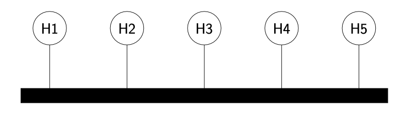

## sharing resources
fino ad ora ci siamo sempre concentrati su due host. Nel mondo reale la connessione è effettuata tra diversi dispositivi contemporaneamente, come facciamo a connettere diversi host contemporaneamente?

#### full mesh network

- **pro**: è una rete molto robusta, che consente una comunicazione diretta con ogni host
- **contro**: la rete è difficile da far scalare, infatti, se si aggiunge un nodo, bisogna creare molti collegamenti

#### bus network

- **pro**: molto economica come rete, infatti è presente un solo canale di comunicazione
- **contro**: non scala, infatti tutte le comunicazioni devono passare per lo stesso cavo; inoltre non è nemmeno robusta, se il cavo si guasta, la rete smette di funzionare

#### ring network

- **pro**: è una soluzione più robusta
- **contro**: risulta comunque complicato farla scalare

#### star network

- **pro** è una rete abbastanza robusta, in quanto si ha un link dedicato per ogni nodo, è semplice da gestire, infatti è presente un nodo centrale a gestire l'intera rete
- **contro**: se il nodo centrale smette di funzionare, tutta la rete smette di funzionare