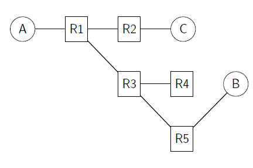
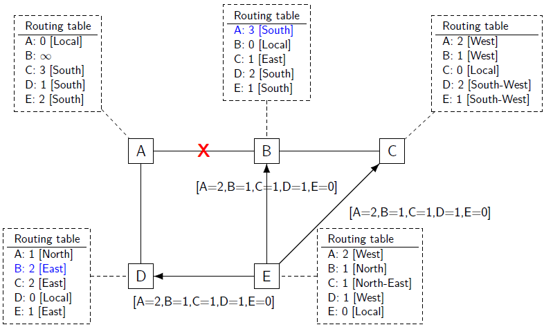

## nv routing
## network layer
mentre il compito del livello data link è quello di mettere in comunicazione un host con il resto degli altri attraverso il canale fisico.
Il livello **network** ha il compito di collegare host che non fanno parte della stessa rete fisica attraverso l'utilizzo di **router**.

in questa foto i cerchi rappresentano gli **host**, i quadrati sono i **router** si occupano solamente di instradare il traffico.

Il frame del datalink è detto **pacchetto**, che contiene un header, che verrà incapsulato nel payload del frame del livello datalink.

Esistono due tipi:
- **datagram-oriented**: usato attualmente da Internet
- **circuit-oriented**

### datagram oriented
ogni host del livello rete è identificato da un **indirizzo**; per poter inviare un pacchetto ad un host, il mittente deve creare un pacchetto che contiene:
- l'indirizzo dell'host del mittente
- l'indirizzo dell'host del destinatario
- l'informazione che deve essere inviata

i router usano un tipo di comunicazione chiamata **hop-by-hop**, dove un router riceve un pacchetto (non destinato per lui), prende una decisione sul dove inviarlo e lo inoltra al prossimo router.

Le decisioni sono prese in base a una **forwarding table**: una struttura dati che mappa un indirizzo di destinazione con uno (o più indirizzi) destinazione; la tabella viene consultata per ogni pacchetto che viene ricevuto.
2 tipi di errori possono succedere:
- **black holes**: situazione in cui un router riceve un pacchetto ma nella tabella di routing non sa dove inviarlo, il pacchetto viene scartato
- **loops**

Ogni router si occupa di svolgere due funzioni:
- **data plane**: si occupa di instradare i pacchetti, in base al contenuto delle tabelle di routing
- **control plane**: processo che si occupa di creare e mantenere le tabelle di routing. Il modo più semplice per creare le tabelle consiste nel farlo a mano, questa cosa non scala, è necessario trovare un modo per farlo automaticamente. Introduciamo quindi dei pacchetti speciali non contenenti dati, ma informazioni utili per creare le tabelle di routing

All'interno di un contesto privato è possibile che eista un controller dedicato che si occupa di gestire l'intera rete privata; è in grado quindi di configurare le tabelle di routing, questo approccio è detto **centralizzato**.
All'interno di Internet un approccio centralizzato risulta impossibile, per questo si usa l'approccio **distribuito**

### addressing

**flat addressing**
in questo approccio gli indirizzi sono completamente scorrelati tra di loro, infatti sono quelli decisi dal produttore.
- **pro**: non è necessario fare alcun tipo di configurazione
- **contro**: in questo modo la rete non scala. Dato che Internet contiene miliardi di indirizzi, questo significa che ogni forwarding table deve avere miliardi di entry.

**hirerchical addressing**
in questo approccio, gli indirizzi sono divisi in **blocchi**; ai router viene quindi assegnato uno o più blocchi. In questo modo le dimensioni delle forwarding tables sono molto più piccole.
Nel momento in cui un host cambia network, il suo indirizzo cambia di conseguenza (ci si sposta da casa all'università). è fondamentale quindi trovare un modo per:
- un modo per assegnare un indirizzo ad un host che si collega alla rete
- garantire all'host il mantenimento delle connessioni passate nel momento in cui cambia rete

### algoritmi di routing

#### hot potato
L'algoritmo funziona come segue:
un host vuole inviare un pacchetto, sapendo solamente dov'è l'idirizzo destinazione, invia il pacchetto a tutti i link che, se conoscono la destinazione, instradano il pacchetto, altrimenti fanno broadcast. se un host riceve un pacchetto non destianto a lui, lo scarta.

questo tipo di algoritmo è usato in reti semplici e di piccole dimensioni ed è fondamentale che la rete abbia una forma ad **albero**, altrimente viene creato un **loop**.

#### virtual circuits
il principio di funzionamento è preso dalla rete telefonica, dove un circuito fisico collega il mittente e il destinatario.
Un approccio simile è possibile applicarlo quando la rete è centralizzata. Per ogni coppia di mittente/ricevitore, è definito un percorso. L'header conterrà quindi il **circuito virtuale** al quale appartiene il pacchetto.
Questa tecnologia non è molto usata.

---

#### control plane
- **algoritmo**: sequenze di istruzioni volte a risolvere un problema
- **protocollo di routing**: contiene una serie di specifiche usate per implementare l'algoritmo all'interno del router
- **daemon**: è il software nel router che si occupa di implementare il protocollo di routing; è la logica che crea i pacchetti di controllo e li invia, mantiene le tabelle di routing

#### routing table vs forwarding table
una tabella di **routing** contiene informazioni più generali rispetto ad una tabella di forwarding; infatti, lo stesso router può contenere diverse tabelle di routing (una tabella di routing puo, per esempio, essere gestita dal deamon, l'altra dall'amministratore).
L'obiettivo di un protocollo di routing è quello di riempire le tabelle di routing nei vari router della rete.
La tabella di **forwarding** all'interno di un router è creata unendo le diverse tabelle di routing. Le tabelle di forwarding sono usate dai router per prendere decisioni su dove indirizzare i pacchetti

---

#### distance vector routing (dv-routing)
è un algoritmo efficiente, semplice da implementare, leggero ma lento a convrgere.
Funzionamento:
- ad ogni link viene assegnato un **costo** (si riceve una penalità se si passa per un link costoso)
- ogni router inizializza la tabella di routing con il suo indirizzo e distanza pari a `0`
- peridocamente ogni router invia la sua tabelle di routing (dv) a i nodi vicini

pseudocodice per **inviare** il distance vector:
```python
Every N seconds:
    v = Vector()
    for d in R[]:
        # add destination d to vector
        v.add(Pair(d, R[d].cost))
    for i in interfaces:
        # send vector v on this interface
        send(v, i)
```

pseudocodice per **ricevere** il distance vector:
```python
# V: received Vector
# l : link over which vector is received
def received(V, l):
    # received vector from link l
    for d in V[]:
        if not (d in R[]):
            # new route
            R[d].link = l
            R[d].cost = V[d].cost + l.cost
            R[d].time = new()
        else:
            # existing route
            if ((V[d].cost + l.cost) < R[d].cost) or (R[d].link == l):
                R[d].link = l
                R[d].cost = V[d].cost + l.cost
                R[d].time = now()
```

- line 6: se il distance vector contiene un indirizzo di destinzaione che il router non conosce allora lo aggiunge alla routing table
- line 13: se la destinazione è già conosciuta, la aggiorana solamente se:
  - il costo è minore rispetto a quello attuale

#### failure recovery
qundo, ogni `N` secondi tutti i router inviano il loro distance vector, il timestamp deve essere aggiornato. Nessun router dovrebbe avere un timestamp più grande di `N` secondi. Se un router ha un timestamp più grande di `k x N` secondi, il suo costo è impostato a $\infty$.
Dopo questo tempo, il router viene rimosso dalla tabella di routing.

