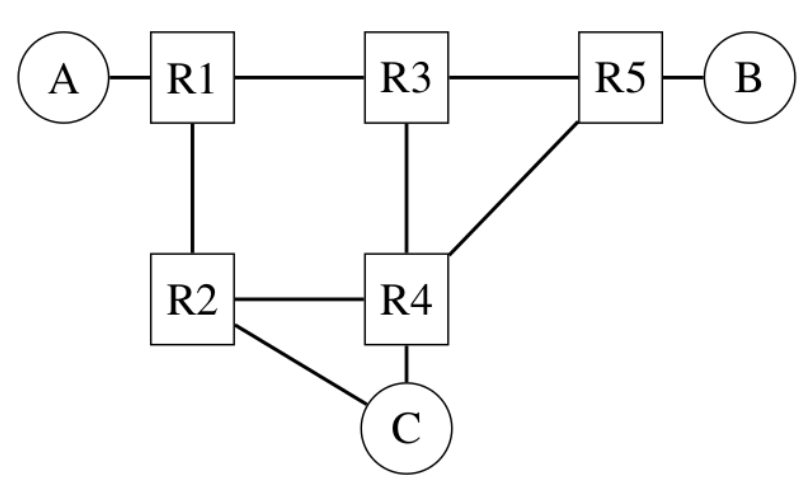

## nv routing
## network layer
mentre il compito del livello data link è quello di mettere in comunicazione un host con il resto degli altri attraverso il canale fisico.
Il livello **network** ha il compito di collegare host che non fanno parte della stessa rete fisica attraverso l'utilizzo di **router**.

in questa foto i cerchi rappresentano gli **host**, i quadrati sono i **router** si occupano solamente di instradare il traffico.

Il frame del datalink è detto **pacchetto**, che contiene un header, che verrà incapsulato nel payload del frame del livello datalink.

Esistono due tipi:
- **datagram-oriented**: usato attualmente da Internet
- **circuit-oriented**

### datagram oriented
ogni host del livello rete è identificato da un **indirizzo**; per poter inviare un pacchetto ad un host, il mittente deve creare un pacchetto che contiene:
- l'indirizzo dell'host del mittente
- l'indirizzo dell'host del destinatario
- l'informazione che deve essere inviata

i router usano un tipo di comunicazione chiamata **hop-by-hop**, dove un router riceve un pacchetto (non destinato per lui), prende una decisione sul dove inviarlo e lo inoltra al prossimo router.

Le decisioni sono prese in base a una **forwarding table**: una struttura dati che mappa un indirizzo di destinazione con uno (o più indirizzi) destinazione; la tabella viene consultata per ogni pacchetto che viene ricevuto.
2 tipi di errori possono succedere:
- **black holes**: situazione in cui un router riceve un pacchetto ma nella tabella di routing non sa dove inviarlo, il pacchetto viene scartato
- **loops**

Ogni router si occupa di svolgere due funzioni:
- **data plane**: si occupa di instradare i pacchetti, in base al contenuto delle tabelle di routing
- **control plane**: processo che si occupa di creare e mantenere le tabelle di routing. Il modo più semplice per creare le tabelle consiste nel farlo a mano, questa cosa non scala, è necessario trovare un modo per farlo automaticamente.