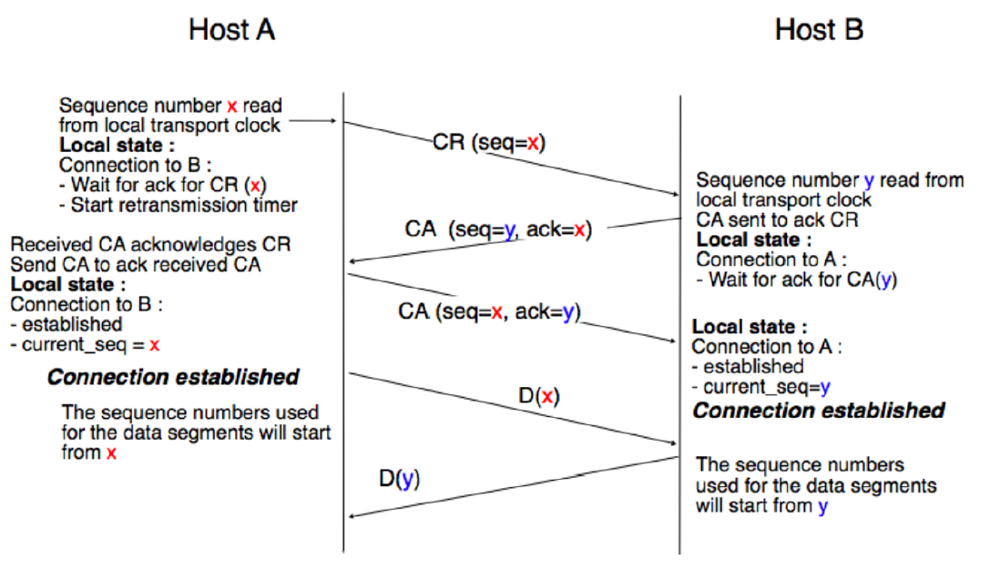

# livello trasporto

come gia detto, il software in esecuzione al layer $X$ deve essere correttamente interpretabile dal livello $X-1$. Questa cosa è possiblie grazie a una serie di interfacce tra i layers.
Le interfacce prendono il nome di **servizi** tra i layer.

Il livello network fornisce un **SDU** (Service Data Unit) al livello superiore. L'SDU è un servizio *connectionless* e *unreliable*. Questa cosa significa che i pacchetti non fanno parte di una *connessione* (modo per associare due host tra di loro); ogni host si sposta da un indirizzo sorgente a uno destinazione in modo indipendente.

#### modelli applicativi
prima di parlare del transport layer, vediamo un comune modello applicativo: **client-server**
questo modello è composto da:
- **server**: entità che offre un servizio
- **client**: entità che richiede il servizio

Il livello di trasporto offre alle applicazioni il servizio per poter inviare i dati.

Abbiamo due requisiti che dobbiamo soddisfare:
- **multiplexing**: come facciamo a fare in modo che molte applicazioni comunicano tra di loro senza che i messaggi si mischiano?
- come facciamo a rendere **affidabili** delle connessioni che non lo sono?

Il ruolo del livello di trasporto (livello tra *applicazione* e *network*) è soddisfare questi due requisiti.

#### servizi orientati e non orientati alla connessione
le applicazioni non sanno nulla di segmenti e pacchetti, hanno solamente un **buffer** con il livello di trasporto che usano per inviare i dati.
Il livello di trasporto spezza i dati inviati dall'applicazione in **segmenti** e li passa al livello di rete

#### servizi non orientati alla connessione
servizio **stateless**: i segmenti viaggiano indipendentemente l'uno dall'altro, il livello di trasporto non salva nessuna variabile di stato.
vengono forniti:
- scambio di dati *unreliable*, solitamente con rilevamento di errori
- *multiplexing* agli endpoint

per poter garantire il *rilevamento degli errori*, il livello di trasporto aggiunge all'**header** un **checksum** che viene usato per rilevare gli errori.

il *multiplexing* (in modo molto brutto significa "avere un singolo canale per diverse applicazioni") viene fatto sfruttando il concetto di **porta**

**numeri di porta**
L'header del segmento contiene due campi: 
- **porta sorgente**: indica la porta del mittente
- **porta destinazione**: indica la porta del destinatario

quando il livello di trasporto riceve un pacchetto, lo invia all'applicazione a cui è associata quella porta.

#### servizi orientati alla connessione
questi servizi instaurano una connessione tra due endpoint (solitamente tra client e server)
la connessione ha uno **stato**: rappresentato da una seri di variabili interne usate per tenera traccia dello stato della connessione.
Prima di poter inviare dati è necessario stabilire una connessione tra i due host, che verrà rilasciata quando non sarà più necessaria.
Il multiplexing funziona come nei servizi non orientati alla connessione

**connection set-up**
stabilire la connessione può essere semplice come l'invio di due frame. Bisogna comunque tenere conto che il livello di rete è *unreliable*. Una serie di eventi potrebbero succedere:

- **pacchetti duplicati**
La richiesta di connessione, inviata una sola volta, viene ricevuta due volte.
L'idea di usare identificativi univoci è da scartare perchè implica che il server deve salvare la lista di tutti questi id.

**Maximum Segment Life (MSL)**
anche se il livello rete è unreliable, bisogna fare delle assunzioni: i duplicati possono essere causati da un loop temporaneo. Definiamo quindi un **MSL** che indica il tempo massimo che un pacchetto può circolare all'interno della rete

**transport clock**
il livello di trasporto ha un proprio clock che viene usato per gestire il MSL. Quando il livello di trasporto riceve un pacchetto, controlla il timestamp del pacchetto e lo confronta con il suo clock. Se il pacchetto è vecchio, viene scartato.

**initial sequence number (ISN)**
ogni richiesta di connessione (CR) ha un ISN. Il server, quando invia una risposta (CA) allega il ISN. Quando il client riceve la risposta controlla l'ISN e vede se è relativo ad una connessione attiva.

**comunicazione a due vie**
le connessioni, essendo bi-direzionali, necessitano della presenza di un ISN per ogni lato della connessione.

#### three-way handshake

**interruzione della connessione**
entrambi gli endpoind devono essere a conoscenza della chiusura della connessione:
- il primo endpoint invia la richiesta di chiusura
- il secondo invia ACK e la sua richiesta di chiusura
- il primo risponde con ACK
- la connessione è stata chiusa