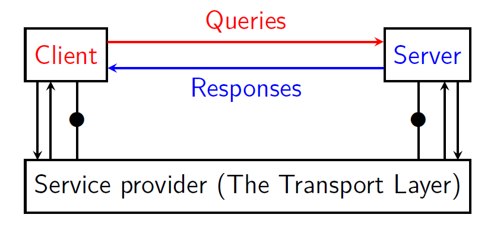

# livello trasporto

come gia detto, il software in esecuzione al layer $X$ deve essere correttamente interpretabile dal livello $X-1$. Questa cosa è possiblie grazie a una serie di interfacce tra i layers.
Le interfacce prendono il nome di **servizi** tra i layer.

Il livello network fornisce un **SDU** (Service Data Unit) al livello superiore. L'SDU è un servizio *connectionless* e *unreliable*. Questa cosa significa che i pacchetti non fanno parte di una *connessione* (modo per associare due host tra di loro); ogni host si sposta da un indirizzo sorgente a uno destinazione in modo indipendente.

#### modelli applicativi
prima di parlare del transport layer, vediamo un comune modello applicativo: **client-server**
questo modello è composto da:
- **server**: entità che offre un servizio
- **client**: entità che richiede il servizio

Il livello di trasporto offre alle applicazioni il servizio per poter inviare i dati.

Abbiamo due requisiti che dobbiamo soddisfare:
- **multiplexing**: come facciamo a fare in modo che molte applicazioni comunicano tra di loro senza che i messaggi si mischiano?
- come facciamo a rendere **affidabili** delle connessioni che non lo sono?

Il ruolo del livello di trasporto (livello tra *applicazione* e *network*) è soddisfare questi due requisiti.

#### servizi orientati e non orientati alla connessione
le applicazioni non sanno nulla di segmenti e pacchetti, hanno solamente un **buffer** con il livello di trasporto che usano per inviare i dati.
Il livello di trasporto spezza i dati inviati dall'applicazione in **segmenti** e li passa al livello di rete

