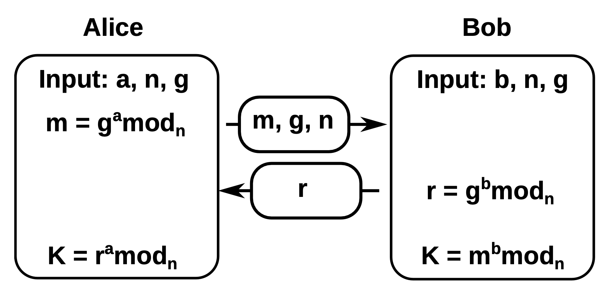
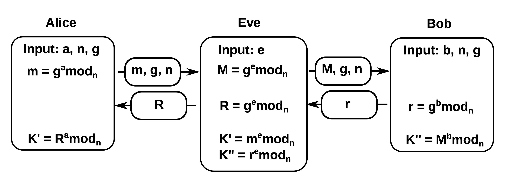

# public key encryprion
un piccolo ripasso sulla [chiave simmetrica](./10-symmetric-key-cryptography.md).
abbiamo visto che:
- Alice e Bob si scambiano una chiave segreta attraverso un canale sicuro (io vado fisicamente in banca e ottengo la chiave)
- la stessa chiave è usata sia per criptare che per decriptare il messaggio (motivo per cui si chiama chiave simmetrica)

è necessario avere quindi un canale sicuro sul quale scambiarsi la chiave segreta, verrà usato solamente per lo scambio, il resto della comunicazione avviene in un canale non sicuro.

#### principi chiave pubblica
il principio alla base della chiave pubblica è permettere ad Alice e Bob di poter comunicare in modo sicuro senza doversi scambiare nessuna informazione sensibile.
esistono molti algoritmi per assolvere a questo scopo, i più famosi sono:
- **Diffie-Halleman** Key exchange
- **RSA** public key encryption
- **Elliptic curve** encryption (non viene trattata all'interno del corso)

#### Diffie-Halleman
DH è un protocollo pensato per permettere ad Alice e Bob di negoziare una chiave simmetrica segreta senza doversi scambiare alcuna informazione sensibile.
è basato sulla difficoltà di computare il logaritmo discreto.

- Alice sceglie un numero $n$ primo, $a$ casuale, $g$ che corrisponde ad una radice primitiva di $n$ (cioè $g$ è un generatore di $n$ -> non so che vuol dire)
- Alice calcola $m = g^a mod_n$
- Alice invia $m$, $g$, $n$ a Bob (anche lui ha effettuato gli stessi passaggi)
- Bob risponde con il suo $m$ (nell'immagine rappresentato da $r$)
- sia Alice che Bob generano la chiave $K$

Nel caso in cui Eve dovesse intercettare il traffico, non sarebbe in grado di generare la chiave $K$ perchè non sarebbe a conoscenza dei vaori $a$ e $b$ (che solo Alice e Bob conoscono).
Il problema ricorrerebbe se Eve non facesse solo sniffing ma un vero e proprio man in the middle.

In **conclusione** il protocollo DH è in grado di garantire *confidenzialità* solamente se accoppiato con un sistema che garantisca *autenticazione*